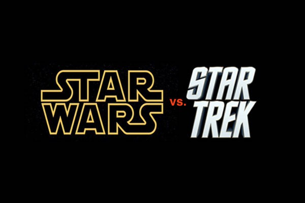

# StarTrekvsStarWars
This is going to provide a comparison of Star Trek ships compared to Star Wars.
## Motivation
The need for a collaborative project. 
## Build status
Self-contained C# Console Application. 
## Code style
C#
## Screenshots

## Tech/framework used
(IDE) Used for this project was 'Visual Studio 2019'.
## How to use?
This is a standard C# console application.  
1.	Just download this to you preferred computer location.  
2.	Locate the .sln file with visual studio.
3.	It should launch.
## Credits
(adding later)
## License
I have placed this under the provisions and guidelines of MIT License. 
MIT © [Gilbert Gonzales]()

